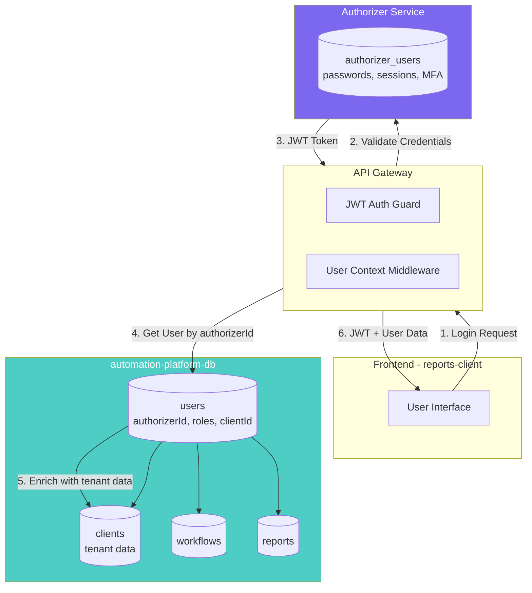

# 🔐 Authorizer Integration Architecture

**Version:** 1.0.0
**Last Updated:** 2025-12-02
**Status:** Production

---

## 📋 Overview

This document describes the integration between **automation-platform-db** and **Authorizer**, our external authentication service. The integration follows a clean separation of concerns:

- **Authorizer**: Handles all authentication (passwords, tokens, MFA, email verification)
- **automation-platform-db**: Handles business logic (roles, permissions, multi-tenant relationships)

---

## 🏗️ Architecture Diagram



---

## 🔗 User Model Integration

### Before (Deprecated - FASE 0-4)

```prisma
model User {
  id            String      @id @default(cuid())
  email         String      @unique
  passwordHash  String      // ❌ Stored passwords
  emailVerified Boolean     // ❌ Duplicate verification status
  // ...
}
```

**Problems:**
- Duplicate authentication logic
- Security risk (password storage)
- Difficult to maintain (two sources of truth)
- No SSO capabilities

### After (Current - FASE 5+)

```prisma
model User {
  id            String      @id @default(cuid())
  authorizerId  String      @unique  // ✅ Link to Authorizer
  email         String      @unique  // For business queries only
  firstName     String?
  lastName      String?
  role          UserRole    @default(USER)
  status        UserStatus  @default(ACTIVE)
  clientId      String?     // Multi-tenant relationship
  // ...
}
```

**Benefits:**
- Single source of truth for authentication (Authorizer)
- No password storage in business database
- SSO ready
- MFA handled externally
- Easier GDPR compliance

---

## 🔄 Authentication Flow

### 1. User Signup

```
┌─────────────┐      ┌─────────────┐      ┌─────────────────┐      ┌─────────────┐
│   Frontend  │      │ API Gateway │      │   Authorizer    │      │   Platform  │
│             │      │             │      │                 │      │   Database  │
└─────────────┘      └─────────────┘      └─────────────────┘      └─────────────┘
       │                     │                     │                       │
       │  POST /auth/signup  │                     │                       │
       ├────────────────────>│                     │                       │
       │  { email, password }│                     │                       │
       │                     │                     │                       │
       │                     │  GraphQL signup     │                       │
       │                     ├────────────────────>│                       │
       │                     │  mutation           │                       │
       │                     │                     │                       │
       │                     │                     │ CREATE user           │
       │                     │                     │ (authorizer_users)    │
       │                     │                     │                       │
       │                     │  { access_token,    │                       │
       │                     │    user { id, ... }}│                       │
       │                     │<────────────────────│                       │
       │                     │                     │                       │
       │                     │ *** WEBHOOK TRIGGER ***                    │
       │                     │                     ├──────────────────────>│
       │                     │                     │ user.signup event     │
       │                     │                     │                       │
       │                     │                     │                CREATE │
       │                     │                     │                users  │
       │                     │                     │          (authorizerId)│
       │                     │                     │                       │
       │  { access_token,    │                     │                       │
       │    user { ... }}    │                     │                       │
       │<────────────────────│                     │                       │
       │                     │                     │                       │
```

**Key Points:**
1. User created in Authorizer first (password, email)
2. Webhook triggers to sync user to platform database
3. Platform user created with `authorizerId` reference
4. Frontend receives JWT from Authorizer

### 2. User Login

```
┌─────────────┐      ┌─────────────┐      ┌─────────────────┐      ┌─────────────┐
│   Frontend  │      │ API Gateway │      │   Authorizer    │      │   Platform  │
│             │      │             │      │                 │      │   Database  │
└─────────────┘      └─────────────┘      └─────────────────┘      └─────────────┘
       │                     │                     │                       │
       │  POST /auth/login   │                     │                       │
       ├────────────────────>│                     │                       │
       │  { email, password }│                     │                       │
       │                     │                     │                       │
       │                     │  GraphQL login      │                       │
       │                     ├────────────────────>│                       │
       │                     │  mutation           │                       │
       │                     │                     │                       │
       │                     │                     │ VALIDATE credentials  │
       │                     │                     │ (authorizer_users)    │
       │                     │                     │                       │
       │                     │  { access_token,    │                       │
       │                     │    user { id, ... }}│                       │
       │                     │<────────────────────│                       │
       │                     │                     │                       │
       │  { access_token,    │                     │                       │
       │    user { ... }}    │                     │                       │
       │<────────────────────│                     │                       │
       │                     │                     │                       │
```

### 3. Protected Request with JWT

```
┌─────────────┐      ┌─────────────┐      ┌─────────────────┐      ┌─────────────┐
│   Frontend  │      │ API Gateway │      │   Authorizer    │      │   Platform  │
│             │      │             │      │                 │      │   Database  │
└─────────────┘      └─────────────┘      └─────────────────┘      └─────────────┘
       │                     │                     │                       │
       │  GET /workflows     │                     │                       │
       ├────────────────────>│                     │                       │
       │  Authorization:     │                     │                       │
       │  Bearer <JWT>       │                     │                       │
       │                     │                     │                       │
       │                     │ [JWT Auth Guard]    │                       │
       │                     │ POST /auth/verify   │                       │
       │                     ├────────────────────>│                       │
       │                     │ { token }           │                       │
       │                     │                     │                       │
       │                     │                     │ VALIDATE JWT signature│
       │                     │                     │ CHECK expiration      │
       │                     │                     │ CHECK revocation      │
       │                     │                     │                       │
       │                     │  { valid: true,     │                       │
       │                     │    user { id, ... }}│                       │
       │                     │<────────────────────│                       │
       │                     │                     │                       │
       │                     │ [User Context]      │                       │
       │                     │ SELECT * FROM users │                       │
       │                     │ WHERE authorizerId=?├──────────────────────>│
       │                     │                     │                       │
       │                     │                     │                SELECT │
       │                     │                     │                users  │
       │                     │                     │          + client data│
       │                     │                     │<──────────────────────│
       │                     │                     │                       │
       │                     │ [Business Logic]    │                       │
       │                     │ SELECT * FROM       │                       │
       │                     │ workflows           │                       │
       │                     │ WHERE clientId=?    ├──────────────────────>│
       │                     │                     │                       │
       │                     │                     │                SELECT │
       │                     │                     │             workflows │
       │                     │                     │<──────────────────────│
       │                     │                     │                       │
       │  { workflows: [...] }                    │                       │
       │<────────────────────│                     │                       │
       │                     │                     │                       │
```

**Key Points:**
1. JWT validated against Authorizer (signature, expiration, revocation)
2. Platform user fetched by `authorizerId`
3. Request enriched with tenant data (clientId)
4. Business queries scoped by clientId (multi-tenant isolation)

---

## 📊 Database Schema

### User Table (Final Schema)

```sql
CREATE TABLE users (
  id              TEXT PRIMARY KEY,
  authorizer_id   TEXT NOT NULL UNIQUE,  -- FK to Authorizer
  email           TEXT NOT NULL UNIQUE,
  first_name      TEXT,
  last_name       TEXT,
  role            TEXT NOT NULL DEFAULT 'USER',
  status          TEXT NOT NULL DEFAULT 'ACTIVE',
  client_id       TEXT,
  created_at      TIMESTAMP NOT NULL DEFAULT NOW(),
  updated_at      TIMESTAMP NOT NULL,
  last_login_at   TIMESTAMP,

  CONSTRAINT fk_client FOREIGN KEY (client_id) REFERENCES clients(id) ON DELETE CASCADE
);

CREATE UNIQUE INDEX idx_users_authorizer_id ON users(authorizer_id);
CREATE INDEX idx_users_email ON users(email);
CREATE INDEX idx_users_client_id ON users(client_id);
CREATE INDEX idx_users_status ON users(status);
```

### Key Indexes

| Index | Purpose | Performance Impact |
|-------|---------|-------------------|
| `idx_users_authorizer_id` | Fast lookup by Authorizer ID | Critical - Used on every authenticated request |
| `idx_users_email` | Business queries by email | Medium - Used for user search, reports |
| `idx_users_client_id` | Multi-tenant queries | High - Used for tenant isolation |
| `idx_users_status` | Filter active users | Medium - Used for access control |

---

## 🔄 Webhook Synchronization

### Configured Webhooks

| Event | Endpoint | Purpose | Handler |
|-------|----------|---------|---------|
| `user.signup` | `POST /webhooks/authorizer/user-signup` | Create user in platform DB | `UserSyncService.createFromAuthorizer()` |
| `user.updated` | `POST /webhooks/authorizer/user-updated` | Sync profile changes | `UserSyncService.updateFromAuthorizer()` |
| `user.deleted` | `POST /webhooks/authorizer/user-deleted` | Soft delete or cascade delete | `UserSyncService.deleteFromAuthorizer()` |
| `user.login` | `POST /webhooks/authorizer/user-login` | Update lastLoginAt | `UserSyncService.trackLogin()` |

### Webhook Payload Example

```json
{
  "event": "user.signup",
  "timestamp": 1733107200000,
  "user": {
    "id": "e8f7a6d5-4c3b-2a1f-0e9d-8c7b6a5f4e3d",
    "email": "user@example.com",
    "given_name": "John",
    "family_name": "Doe",
    "email_verified_at": null,
    "roles": "user",
    "signup_methods": "email",
    "created_at": 1733107200000,
    "updated_at": 1733107200000
  },
  "signup_method": "email"
}
```

### Synchronization Logic

```typescript
// API-Gateway/src/users/user-sync.service.ts

async createFromAuthorizer(authorizerUser: AuthorizerUser): Promise<User> {
  return await this.prisma.user.create({
    data: {
      authorizerId: authorizerUser.id,
      email: authorizerUser.email,
      firstName: authorizerUser.given_name,
      lastName: authorizerUser.family_name,
      role: this.mapRoles(authorizerUser.roles),
      status: authorizerUser.email_verified_at ? 'ACTIVE' : 'PENDING_VERIFICATION',
    },
  });
}
```

---

## 🛡️ Security Considerations

### 1. No Password Storage

**Rule**: NEVER store passwords or password hashes in automation-platform-db.

**Rationale**:
- Reduces attack surface
- Centralizes security updates in Authorizer
- Simplifies GDPR compliance
- Enables SSO without schema changes

### 2. JWT Validation

**Rule**: ALWAYS validate JWT with Authorizer before trusting claims.

**Implementation**:
```typescript
// API-Gateway/src/auth/guards/jwt-auth.guard.ts

async validateToken(token: string): Promise<boolean> {
  const response = await this.authorizerService.verify(token);
  return response.valid;
}
```

**Why**: Client-side JWT manipulation, token leakage, or expiration bypass.

### 3. Multi-Tenant Isolation

**Rule**: ALL queries MUST filter by clientId.

**Good**:
```typescript
const workflows = await prisma.workflow.findMany({
  where: { clientId: user.clientId },  // ✅ Tenant isolation
});
```

**Bad**:
```typescript
const workflows = await prisma.workflow.findMany();  // ❌ Cross-tenant leak
```

### 4. Webhook Authentication

**Rule**: Verify webhook signatures to prevent spoofing.

**Implementation**:
```typescript
// API-Gateway/src/webhooks/webhooks.controller.ts

@Post('authorizer/user-signup')
async handleUserSignup(
  @Body() payload: WebhookPayload,
  @Headers('x-webhook-signature') signature: string,
) {
  if (!this.verifyWebhookSignature(payload, signature)) {
    throw new UnauthorizedException('Invalid webhook signature');
  }
  // Process webhook...
}
```

---

## 🧪 Testing

### Unit Tests

```typescript
// automation-platform-db/tests/user-model.test.ts

describe('User Model', () => {
  it('should create user with authorizerId', async () => {
    const user = await prisma.user.create({
      data: {
        authorizerId: 'auth-user-123',
        email: 'test@example.com',
        role: 'USER',
        status: 'ACTIVE',
      },
    });

    expect(user.authorizerId).toBe('auth-user-123');
    expect(user).not.toHaveProperty('passwordHash');  // ✅
    expect(user).not.toHaveProperty('emailVerified'); // ✅
  });

  it('should enforce unique authorizerId', async () => {
    await prisma.user.create({
      data: {
        authorizerId: 'auth-user-123',
        email: 'user1@example.com',
      },
    });

    await expect(
      prisma.user.create({
        data: {
          authorizerId: 'auth-user-123',  // Duplicate
          email: 'user2@example.com',
        },
      })
    ).rejects.toThrow('Unique constraint failed');
  });
});
```

### Integration Tests

```typescript
// API-Gateway/tests/e2e/auth.e2e-spec.ts

describe('Authentication Flow (e2e)', () => {
  it('should complete signup → webhook → platform user creation', async () => {
    // 1. Signup in Authorizer
    const signupResponse = await request(authorizerUrl)
      .post('/graphql')
      .send({
        query: `mutation { signup(params: {...}) { ... } }`
      });

    const authorizerId = signupResponse.body.data.signup.user.id;

    // 2. Wait for webhook processing (async)
    await new Promise(resolve => setTimeout(resolve, 1000));

    // 3. Verify platform user created
    const platformUser = await prisma.user.findUnique({
      where: { authorizerId },
    });

    expect(platformUser).toBeDefined();
    expect(platformUser.email).toBe('test@example.com');
    expect(platformUser.status).toBe('ACTIVE');
  });
});
```

---

## 📝 Migration History

### Migration: Remove Deprecated Auth Fields

**File**: `prisma/migrations/20251202020032_update_user_schema_final/migration.sql`

```sql
-- Step 1: Make authorizerId NOT NULL (all users must have Authorizer account)
ALTER TABLE "users" ALTER COLUMN "authorizerId" SET NOT NULL;

-- Step 2: Remove deprecated authentication fields
ALTER TABLE "users"
  DROP COLUMN "emailVerified",
  DROP COLUMN "passwordHash";

-- Step 3: Update default status (ACTIVE, not PENDING_VERIFICATION)
ALTER TABLE "users" ALTER COLUMN "status" SET DEFAULT 'ACTIVE';
```

**Executed**: 2025-12-02
**Status**: ✅ Completed

---

## 🔍 Troubleshooting

### Problem: User exists in Authorizer but not in Platform DB

**Symptoms**:
- JWT validates successfully
- 404 error when fetching user data

**Diagnosis**:
```sql
-- Check if user exists in platform
SELECT * FROM users WHERE authorizer_id = '<authorizer_user_id>';

-- Check Authorizer webhook logs
SELECT * FROM authorizer_webhook_logs
WHERE event_name = 'user.signup'
AND created_at > NOW() - INTERVAL '1 day'
ORDER BY created_at DESC;
```

**Solution**:
1. Check webhook configuration in Authorizer admin panel
2. Manually trigger webhook resend
3. Create user manually as fallback:
   ```typescript
   await userSyncService.createFromAuthorizer(authorizerUser);
   ```

### Problem: JWT validation fails

**Symptoms**:
- 401 Unauthorized on all protected routes
- "Invalid token" error

**Diagnosis**:
```typescript
// Test JWT validation directly
const isValid = await authorizerService.verify(token);
console.log('Token valid:', isValid);

// Check token expiration
const decoded = jwt.decode(token);
console.log('Token expires at:', new Date(decoded.exp * 1000));
```

**Solution**:
1. Verify Authorizer URL is correct in API Gateway config
2. Check JWT_SECRET matches between Authorizer and API Gateway
3. Verify token not expired (check `exp` claim)
4. Test with fresh token from login

### Problem: Multi-tenant data leak

**Symptoms**:
- User seeing data from other tenants
- Queries returning unexpected results

**Diagnosis**:
```typescript
// Add logging to all queries
prisma.$use(async (params, next) => {
  if (!params.args.where?.clientId) {
    console.error('⚠️ Query without clientId filter:', params);
  }
  return next(params);
});
```

**Solution**:
1. Audit all Prisma queries for `clientId` filter
2. Use middleware to auto-inject `clientId` filter
3. Add database-level RLS (Row Level Security) policies

---

## 📚 References

- [Authorizer Documentation](https://docs.authorizer.dev/)
- [Prisma Multi-tenant Guide](https://www.prisma.io/docs/guides/database/multi-tenant)
- [JWT Best Practices](https://datatracker.ietf.org/doc/html/rfc8725)
- [Webhook Security](https://webhooks.fyi/security/hmac)

---

## 📞 Support

For questions about this integration:

- **Technical Issues**: Create issue in GitHub repository
- **Architecture Questions**: Contact Lead Engineer
- **Security Concerns**: Contact DevOps/Security team

---

**Document Version**: 1.0.0
**Last Reviewed**: 2025-12-02
**Next Review**: 2025-03-02 (3 months)
